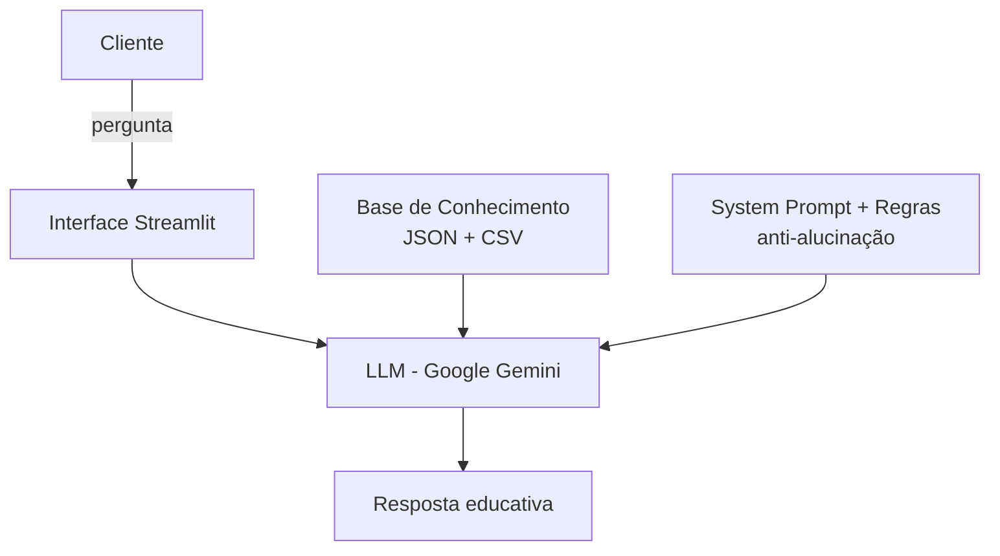

# 🪙 finkAIron — Agente Financeiro Inteligente com IA Generativa

> Chatbot de **educação financeira e investimentos** que usa IA Generativa para
> ensinar, desmistificar o mercado financeiro e personalizar explicações com base
> no perfil, nas transações e no histórico de atendimento de cada cliente.

Construído com **Streamlit** (interface) + **Google Gemini** (LLM via API), o projeto
nasceu do desafio **[Bia do Futuro](https://github.com/PatriciaCorreiaSI/dio-lab-bia-do-futuro)**
da **DIO** em parceria com o **Bradesco** e foi desenvolvido do conceito ao protótipo funcional.

---

## 💡 O nome

O nome escolhido **finkAIron** une o prefixo **fin**anceiro ao conceito grego de **Kairós** (o momento
oportuno) com a terminação tecnológica **-ron**. O destaque em **AI** evidencia um agente
guiado por inteligência artificial — focado em **educar e investir na hora exata**.

---

## 🎯 O que o agente resolve

Muitas pessoas mantêm o dinheiro parado na poupança ou caem em armadilhas financeiras
(consórcios, títulos de capitalização) por falta de conhecimento prático. O finkAIron atua
como **consultor e educador**, ajudando o usuário a:

- **Desmistificar o mercado** — entender a diferença entre Renda Fixa e Renda Variável;
- **Construir uma base sólida** — montar uma reserva de emergência com liquidez e segurança;
- **Planejar curto e longo prazo** — compreender juros compostos e alinhar prazos a objetivos;
- **Analisar risco** — conhecer mecanismos como o FGC e identificar o próprio perfil de investidor.

> 🔎 **Caso de uso, persona e arquitetura completos:** [`docs/01-documentacao-agente.md`](./docs/01-documentacao-agente.md)

---

## 🧩 Como funciona

O agente recebe a pergunta do usuário e responde usando, como **contexto**, os dados
mockados de um cliente fictício (perfil, transações, histórico e produtos disponíveis).
Esse contexto é injetado no *system prompt* uma única vez, ao criar a sessão de chat com o
Gemini — assim cada resposta já considera o perfil do cliente e o histórico da conversa.



| Componente | Implementação |
|------------|---------------|
| **Interface** | Chatbot em Streamlit (`st.chat_input` / `st.chat_message`) |
| **LLM** | Google Gemini via SDK `google-genai` (modelo padrão: `gemini-2.0-flash-lite`) |
| **Base de Conhecimento** | Arquivos JSON/CSV mockados na pasta [`data/`](./data/) |
| **Segurança** | Regras anti-alucinação no system prompt + chave da API protegida via `.env` |

> 🔎 **Detalhes da integração com o Gemini e por que nuvem em vez de Ollama local:** [`src/README.md`](./src/README.md)

### ☁️ Por que Gemini, e não Ollama local?

O desafio original sugere rodar o modelo localmente com Ollama. Optei pela nuvem com o
Gemini por três motivos: 
- Não pesa na máquina do usuário (todo o processamento fica
nos servidores do Google);
- Permite usar modelos mais robustos sem limitação de
hardware;
- A camada gratuita é generosa e fácil de obter. Basta uma conta Google,
sem cartão de crédito, tornando o projeto reproduzível por qualquer pessoa.

---

## 🚀 Como rodar

> Pré-requisito: Python 3.10+ e uma chave gratuita do Gemini ([Google AI Studio](https://aistudio.google.com/apikey)).

```bash
# 1. Instalar as dependências
pip install -r requirements.txt

# 2. Configurar a chave da API
#    Copie .env.example para .env e cole a sua chave:
#    API_GEMINI_KEY=sua_chave_aqui

# 3. Executar o app (abre no navegador)
streamlit run src/app.py
```

🔐 O arquivo `.env` (com a chave real) é ignorado pelo Git e **nunca** vai para o repositório.

---

## 🛡️ Segurança e anti-alucinação

O finkAIron é um **educador**, não um consultor de investimentos. Por isso, o system prompt
impõe regras explícitas:

- Sempre baseia as respostas nos dados fornecidos e **nunca inventa** informações financeiras;
- **Não recomenda** qual produto comprar — apenas explica vantagens, riscos e o perfil indicado;
- Quando não sabe, **admite** e oferece alternativas;
- Não acessa dados sensíveis (senhas) e **não substitui** um profissional certificado.

---

## 📚 Tecnologias

| | |
|---|---|
| **Linguagem** | Python |
| **Interface** | [Streamlit](https://streamlit.io/) |
| **LLM** | [Google Gemini](https://aistudio.google.com/) (`google-genai`) |
| **Dados** | [pandas](https://pandas.pydata.org/) (CSV) + `json` |
| **Configuração** | [python-dotenv](https://pypi.org/project/python-dotenv/) |

Versões exatas em [`requirements.txt`](./requirements.txt).

---

## 🗂️ Estrutura do repositório

```
agente-financeiro-finkairon/
│
├── README.md                         # Este arquivo — visão geral do projeto
├── requirements.txt                  # Dependências (Streamlit, google-genai, pandas...)
├── .env.example                      # Modelo da chave da API (copie para .env)
├── .gitignore                        # Protege o .env e arquivos temporários
│
├── src/                              # Código da aplicação
│   ├── app.py                        # App principal: interface + integração Gemini
│   └── README.md                     # Como o Gemini é usado + guia de execução detalhado
│
├── data/                             # Base de conhecimento (cliente fictício)
│   ├── perfil_investidor.json        # Perfil, metas e objetivos do cliente
│   ├── transacoes.csv                # Histórico de transações
│   ├── historico_atendimento.csv     # Atendimentos anteriores
│   └── produtos_financeiros.json     # Produtos de investimento disponíveis
│
├── docs/                             # Documentação do agente
│   ├── 01-documentacao-agente.md     # Caso de uso, persona e arquitetura
│   ├── 02-base-conhecimento.md       # Estratégia de dados e montagem do contexto
│   ├── 03-prompts.md                 # System prompt, exemplos e edge cases
│   ├── 04-metricas.md                # Avaliação e métricas de qualidade
│   └── 05-pitch.md                   # Roteiro do pitch
│
├── examples/                         # Referências de implementação por etapa
│   └── README.md
│
└── assets/                           # Recursos visuais (diagramas, screenshots)
    ├── README.md
    └── RoteiroLab.md
```

---

## 🗃️ Base de conhecimento

O agente é alimentado por dados mockados de um cliente fictício (**João Silva**, perfil
moderado), inseridos no contexto do modelo:

| Arquivo | Formato | Para que serve |
|---------|---------|----------------|
| `perfil_investidor.json` | JSON | Personalizar as explicações conforme o perfil e as metas do usuário |
| `transacoes.csv` | CSV | Analisar o padrão de gastos para contextualizar as respostas |
| `historico_atendimento.csv` | CSV | Conhecer o usuário a partir de interações anteriores |
| `produtos_financeiros.json` | JSON | Explicar vantagens, riscos e perfil indicado de cada produto |

> 🔎 **Estratégia de carregamento e exemplo de contexto:** [`docs/02-base-conhecimento.md`](./docs/02-base-conhecimento.md)

---

## 📊 Avaliação

A qualidade do agente é avaliada por três métricas principais — **assertividade**,
**segurança** (evitar alucinações) e **coerência** com o perfil do cliente —, validadas
por cenários de teste estruturados e feedback de usuários reais.

Durante os testes comparativos entre LLMs, o **Claude** foi o que melhor incorporou a
persona do finkAIron; o projeto adotou o **Gemini** pela camada gratuita mais acessível.

> 🔎 **Métricas e cenários de teste:** [`docs/04-metricas.md`](./docs/04-metricas.md)

---

## 📝 Sobre o projeto

Desenvolvido por **[Patrícia Correia](https://github.com/PatriciaCorreiaSI)** a partir do
desafio **Bia do Futuro** da [DIO](https://www.dio.me/), do conceito ao protótipo funcional.
